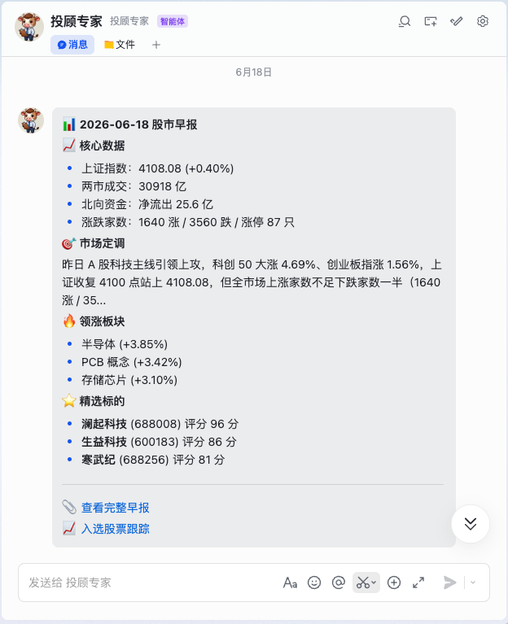
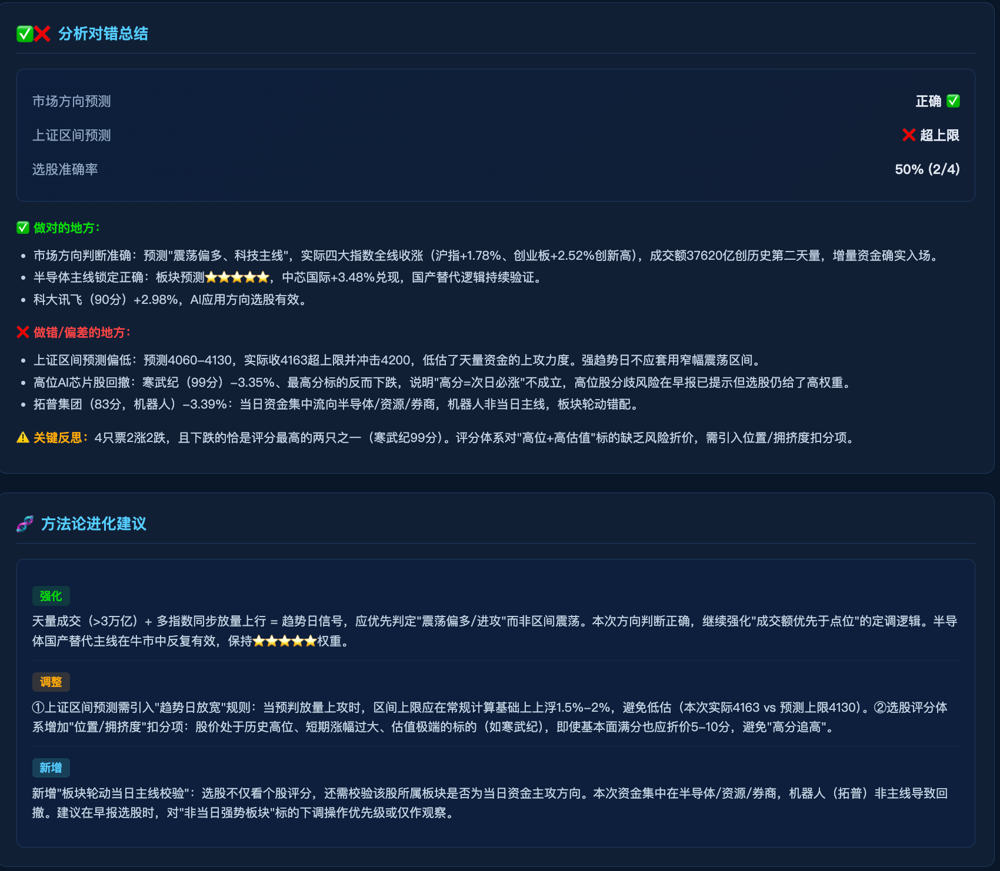
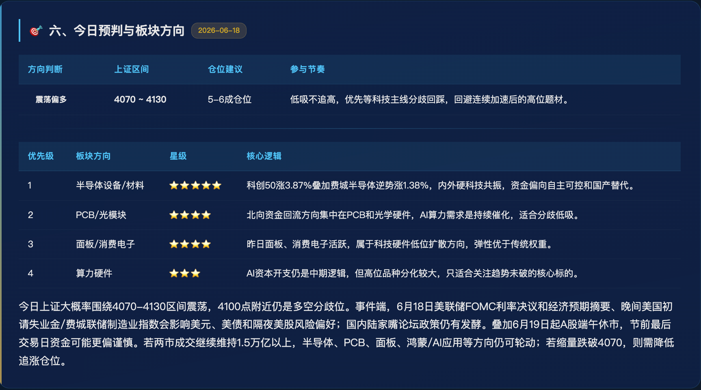
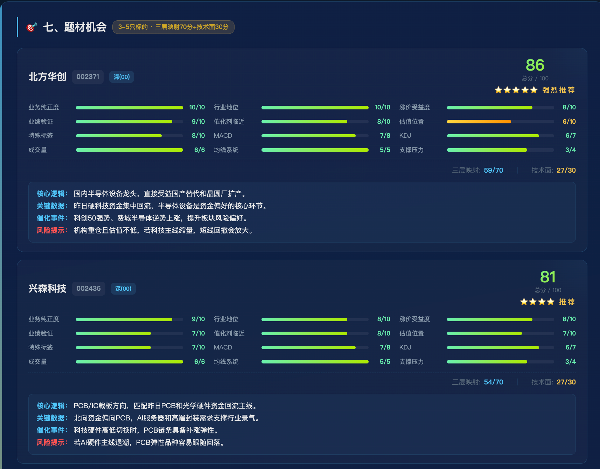

# Agent-Skills

A股智能分析专家团，基于每天喂养的素材+策略，提取分析框架，反哺知识库，增强方法论；基于迭代优化的方法论生成每日早报。

> **架构升级进行中**：正在从"脚本+人肉协议"升级为多 Agent 架构。详见 [REFACTOR_PLAN.md](REFACTOR_PLAN.md)。
> - ✅ **阶段 3 Agent 化**：已完成（5 个 Agent + 编排器 + 双模式 LLM）
> - 🚧 阶段 0/1/2/4/5：规划升级中（见文末 TODO）

## 系统功能目标

| 功能 | 状态 | 说明 |
|------|------|------|
| **盘前策略早报** | 1.0 Skills 版本已实现 / 2.0 Multi-Agent 重构中 | 交易日盘前自动生成策略报告（数据→分析→选股→部署→推送） |
| **收盘复盘与反哺** | 1.0 Skills 版本已实现 / 2.0 Multi-Agent 重构中 | 盘后复盘验证预测对错，反哺方法论优化 |
| **策略学习与方法论进化** | 规划中 | 基于 RAG + Memory 的持续学习能力，方法论自动迭代 |
| **飞书 Bot 集成** | 规划中 | 消息推送、交互式问答、知识输入 |

## Skills 一览

| Skill | 说明 | 触发词 |
|-------|------|--------|
| **stock-morning-brief** | 每日盘前早报：数据获取 → LLM 分析 → HTML 报告 → Cloudflare 部署 → 飞书推送 | 早评、股市早评、每日早报、morning brief |
| **stock-daily-report** | A股收盘日报：18 模块 HTML/PDF 报告 | 收盘报告、A股复盘、今日复盘、daily report |
| **stock-methodology-updater** | 方法论更新器：从样例中提取分析框架，反哺知识库 | 更新方法论、学习方法论、新样例 |

## Agent 架构（阶段 3 已完成）

多 Agent 协作生成早报，每个 Agent 单一职责，由 `workflows/` 编排，Agent 之间不互调。

| Agent | 职责 | 输出字段（llm_analysis.json） |
|-------|------|------|
| **MacroAgent** | 宏观市场分析：A股定调 + 美股影响 + 全球市场 + 情绪 + 方向预测 | MARKET_TONE / US_IMPACT_ON_A / GLOBAL_MARKET_ANALYSIS / EMOTION_FEATURE / TODAY_PREDICTION |
| **SectorAgent** | 板块分析：领涨领跌 + 资金流向 + 昨日复盘 + 信号监控 | SECTORS / YESTERDAY_REVIEW / SIGNALS |
| **StockAgent** | 选股评分：三层映射法（70）+ 技术面（30）+ 风格总结 | STOCKS / STYLE_SUMMARY |
| **RiskManagerAgent** | 风控 Agent：仓位建议、止损点、风险警示 | POSITION_ADVICE / STOP_LOSS_POINTS / RISK_ALERTS |
| **ReviewAgent** | 策略风控：风险 + 策略 + 纪律 + 心态管理 | RISKS / STRATEGY / DISCIPLINES / MENTALITY_ADVICE |
| **LearningAgent** | 学习 Agent：从新资料中提炼方法论，更新知识库 | summary / key_patterns / market_regime / files_updated |

### 双模式 LLM

| 模式 | 触发条件 | 行为 |
|------|---------|------|
| **在线** | `DEEPSEEK_API_KEY` 环境变量存在 | 4 Agent 并发调 DeepSeek API，自动合并 llm_analysis.json |
| **离线** | 无 API Key | 4 Agent 生成 prompt 片段，复用现有 prepare 流程，等待外部执行（兼容人肉协议） |

### 编排器

`workflows/morning_brief.py` 状态机：

```
fetch → macro ──┐
                ├─→ stock → risk_manager → review → compile → render → deploy → push → learn
       sector ──┘
```

- macro / sector 在线模式可并行
- 支持 `--from-step` 断点续跑
- 支持 `--skip-deploy` / `--skip-push`
- **learn** 步骤可选：从当日报告中自动提炼方法论

## 项目结构

```
STOCK-SKILLS/
├── agents/                          # 🆕 多 Agent 实现（阶段 3）
│   ├── __init__.py
│   ├── base.py                      #   BaseAgent + AgentResult + Tool 基类
│   ├── macro_agent.py               #   宏观市场 Agent
│   ├── sector_agent.py              #   板块分析 Agent
│   ├── stock_agent.py               #   选股 Agent
│   └── review_agent.py              #   策略/复盘 Agent
├── workflows/                       # 🆕 编排层（阶段 3）
│   ├── __init__.py
│   └── morning_brief.py             #   早报全链路编排器（状态机+断点续跑+并发）
├── shared/                          # 共享代码模块
│   ├── ai/                          # 🆕 LLM 相关（阶段 3）
│   │   ├── __init__.py
│   │   ├── llm_client.py            #   LLM 客户端（DeepSeek 在线 + 离线回退双模式）
│   │   └── tools.py                 #   Tool 封装（现有脚本 → 可调用工具）
│   ├── cache.py                     #   SQLite 数据缓存
│   ├── config_loader.py             #   配置加载器
│   ├── data_fetcher.py              #   数据获取器 ⚠️ TODO 合并去重（阶段 1）
│   ├── history_data.py              #   历史数据管理
│   ├── logger.py                    #   结构化日志系统 ⚠️ TODO 接入 skills/（阶段 0）
│   ├── scoring_backtest.py          #   评分回测模块
│   ├── technical_indicators.py      #   技术指标计算
│   └── utils.py                     #   工具函数 ⚠️ TODO 去重（阶段 1）
├── knowledge-bases/                 # 方法论知识库
│   ├── stock-methodology/           #   早报/选股方法论（核心）⚠️ TODO 升级 RAG（阶段 4）
│   └── stock-samples/               #   样例数据（gitignore）
├── config/                          # 配置文件
│   ├── base.yaml                    #   基础配置
│   ├── development.yaml             #   开发环境配置
│   └── production.yaml              #   生产环境配置
├── tests/                           # 单元测试
├── logs/                            # 日志文件 ⚠️ TODO 接入 observability（阶段 0/5）
├── skills/                          # 技能模块（旧脚本，保留 3 个月对照）
│   ├── stock-morning-brief/         #   盘前早报
│   │   ├── SKILL.md                 #     技能定义
│   │   ├── scripts/                 #     Python 脚本
│   │   ├── templates/               #     HTML 模板
│   │   ├── references/              #     风格指南 & 样例
│   │   └── docs/                    #     部署指南
│   ├── stock-daily-report/          #   收盘日报
│   └── stock-methodology-updater/   #   方法论更新器
├── REFACTOR_PLAN.md                 # 架构重构方案（5 阶段计划）
└── README.md
```

> **规划中目录**（见文末 TODO）：
> - `memory/` — 运行时记忆（working_memory + state_store）
> - `knowledge/` — RAG 引擎（embedder + vector_store + retriever）
> - `observability/` — 可观测性（metrics + tracing + dashboard）
> - `shared/services/` — 外部服务封装（data_service/deploy/push/pdf）
> - `shared/scoring/` — 评分体系独立模块
> - `shared/indicators/` — 技术指标独立模块

## 快速开始

### 环境要求

- Python 3.9+
- Node.js 22+（Cloudflare 部署需要）
- [WorkBuddy](https://www.codebuddy.cn) 桌面端

### 配置系统

项目使用 YAML 配置文件 + 环境变量覆盖的方式管理配置：

```
config/
├── base.yaml          # 基础配置（所有环境共享）
├── development.yaml   # 开发环境配置
└── production.yaml    # 生产环境配置
```

通过环境变量 `STOCK_SKILLS_ENV` 切换环境（默认 `development`）：

```bash
export STOCK_SKILLS_ENV=development  # 或 production
```

关键环境变量：

| 变量 | 说明 |
|------|------|
| `STOCK_SKILLS_ENV` | 运行环境（development/production） |
| `STOCK_SKILLS_LOG_LEVEL` | 日志级别 |
| `FEISHU_USER_OPEN_ID` | 飞书用户 ID（推送用） |
| `DEEPSEEK_API_KEY` | DeepSeek API Key（在线模式，可选） |

### 生成早报

**方式一：Agent 编排器（推荐，新架构）**

```bash
# 离线模式（默认，生成 prompt 等待外部执行 LLM）
python3 -m workflows.morning_brief

# 在线模式（需配置 DEEPSEEK_API_KEY，全自动）
export DEEPSEEK_API_KEY=your_key
python3 -m workflows.morning_brief

# 断点续跑（从指定步骤开始）
python3 -m workflows.morning_brief --from-step compile

# 跳过部署/推送
python3 -m workflows.morning_brief --skip-deploy --skip-push

# 指定工作目录
python3 -m workflows.morning_brief --work-dir /tmp/morning
```

**方式二：旧脚本路径（保留对照）**

```bash
# 仅生成 HTML
python3 skills/stock-morning-brief/scripts/generate_report.py

# 生成 + 部署 Cloudflare + 飞书推送
python3 skills/stock-morning-brief/scripts/generate_report.py \
  --deploy-cloudflare --feishu-push
```

### 生成收盘日报

```bash
python3 skills/stock-daily-report/scripts/main.py
```

### 测试

```bash
python3 -m pytest tests/ -v
```

## 核心架构

### 数据源优先级

国内数据：AKShare > WebSearch | 海外数据：yfinance > WebSearch

所有数据经 `validate_market_data.py` 校验后才进入报告，WebSearch 补充的数据标记 `source: "websearch"` 并需交叉验证。

### 早报工作流

**新架构（Agent 编排器）**：

```
FetchDataTool           获取市场数据（A股/美股/大宗/汇率）
        ↓
MacroAgent ─┐
            ├─→ StockAgent → ReviewAgent → CompileTool → RenderReportTool → DeployCloudflareTool → PushFeishuTool
SectorAgent─┘
```

**旧架构（脚本串联，保留对照）**：

```
fetch_data.py          获取市场数据
        ↓
generate_ai_texts.py   LLM 分析 → 结构化 JSON
        ↓
generate_report.py     填充 HTML 模板 + 可选 PDF
        ↓
deploy_to_cloudflare   部署到 Cloudflare Pages
        ↓
push_to_feishu         飞书推送摘要 + 链接
```

### 选股评分体系

三层映射法（70 分）+ 技术面（30 分）= 总分 100 分

| 维度 | 项目 | 分值 |
|------|------|------|
| 映射法 | 业务纯正度 / 行业地位 / 涨价受益度 / 业绩验证 / 催化剂临近 / 估值位置 / 特殊标签 | 各 10 |
| 技术面 | MACD(8) / KDJ(7) / 成交量(6) / 均线(5) / 支撑压力(4) | 合计 30 |

评级：≥85 强烈推荐⭐5 / 75-84 推荐⭐4 / 60-74 一般观察⭐3 / <60 不建议⭐2

### 入选股票跟踪

每只入选标的自动跟踪次日 / 3 日 / 5 日 / 7 日累计涨跌幅，数据存储在 `data/stock_selection_tracker.json`，可视化页面部署到 Cloudflare `/stock-tracker/`。

## 报告预览与部署

### 🌐 在线访问

| 页面 | URL |
|------|-----|
| **早报（最新）** | [https://stock-morning-brief.pages.dev/](https://stock-morning-brief.pages.dev/) |
| 历史报告 | `https://stock-morning-brief.pages.dev/YYYY-MM-DD/` |
| 股票跟踪 | [https://stock-morning-brief.pages.dev/stock-tracker/](https://stock-morning-brief.pages.dev/stock-tracker/) |

> 详见 [Cloudflare 部署指南](skills/stock-morning-brief/docs/CLOUDFLARE_DEPLOY_GUIDE.md)

### 📱 报告截图预览

#### ① 飞书推送摘要

每日早报生成后自动推送到飞书，包含核心数据、市场定调、领涨板块和精选标的。



*飞书私聊推送：核心数据（上证指数、成交额、北向资金）+ 市场定调 + 领涨板块 + 精选标的评分*

---

#### ② 分析对错总结（复盘模块）

盘后自动复盘，对方向/区间/选股逐项判对错，输出方法论进化建议。



*复盘卡片：市场方向/区间预测/选股准确率独立打分，正确✅错误✗标注，方法论强化/调整/新增建议*

---

#### ③ 今日预测与板块方向

方向判断（偏多/震荡/偏空/防守）、上证区间、仓位建议、参与节奏，以及优先级排序的板块方向。



*方向研判表：上证区间 / 仓位建议 / 参与节奏，优先级板块含星级评分和核心逻辑*

---

#### ④ 选股评分卡（三层映射法）

每只入选标的 12 项评分条可视化：映射法 7 项（业务纯正度/行业地位/涨价受益度/业绩验证/催化剂临近/估值位置/特殊标签）+ 技术面 5 项（MACD/KDJ/成交量/均线/支撑压力）。



*评分卡示例：北方华创 86 分⭐5 强烈推荐，兴森科技 81 分⭐4 推荐。每项评分含核心逻辑/关键数据/催化剂事件/风险提示*

## 方法论体系

知识库位于 `knowledge-bases/stock-methodology/`，包含：

| 文件 | 说明 |
|------|------|
| `stock_morning_brief_guide.md` | 早报分析方法论（核心框架） |
| `stock_morning_brief_templates.md` | 早报模板与样例表述 |
| `stock_selection_guide.md` | 选股方法论 |

方法论更新通过 `stock-methodology-updater` Skill 进行，遵循"提取方法、不搬运事实"原则。

## 架构升级 TODO（规划升级中）

> 完整方案见 [REFACTOR_PLAN.md](REFACTOR_PLAN.md)

| 阶段 | 状态 | 内容 | 关键交付 |
|------|------|------|---------|
| **阶段 3** | ✅ 已完成 | Agent 化 | 4 Agent + 编排器 + 双模式 LLM + Tool 封装 |
| 阶段 0 | 🚧 规划中 | 观测性基线 | logger 接入 skills/、消灭 14 个 bare except、run_id 贯穿 |
| 阶段 1 | 🚧 规划中 | 消灭重复，shared 真正化 | 合并 data_fetcher + fetch_data、去重 utils、skills/ import shared/ |
| 阶段 2 | 🚧 规划中 | 拆 generate_ai_texts.py | 拆 6 模块：validators/insight_engine/html_builders/prompt_builder/compiler/response_parser |
| 阶段 4 | 🚧 规划中 | RAG 知识库 | bge-small-zh embedding + chromadb + 检索增强 Agent prompt |
| 阶段 5 | 🚧 规划中 | observability 完善 | metrics + tracing + dashboard + 异常告警 |
| 阶段 6 | 🚧 规划中 | WebSearch 去依赖 | Tavily 搜索 API + 固定源补齐 + fetch_data 自动补数据，脱离 WorkBuddy Agent 独立运行 |

### 阶段 6 说明：WebSearch 去依赖

目标：配置 `DEEPSEEK_API_KEY` + `TAVILY_API_KEY` 两个 key 后，`python3 -m workflows.morning_brief` 全自动跑完，无需 WorkBuddy Agent 介入。

| 子任务 | 方案 | 说明 |
|--------|------|------|
| 固定源补齐 | 新浪/AKShare | 日经 225、美元指数、北向成交额（部分可补） |
| 搜索 API | Tavily | 免费 1000 次/月，专为 LLM 设计，结构化返回 |
| fetch_data 改造 | mark_websearch 自动补 | 不再只标记，调 WebSearchTool 自动填数据 |
| LLM 联网兜底（可选） | 通义/Kimi/GLM-4 | Tavily 也失败时兜底 |

### 待新增目录

- `memory/` — 运行时记忆（working_memory + state_store）
- `knowledge/` — RAG 引擎（embedder + vector_store + retriever + indexer）
- `observability/` — 可观测性（metrics + tracing + dashboard）
- `shared/services/` — 外部服务封装（data_service/deploy/push/pdf）
- `shared/scoring/` — 评分体系独立模块
- `shared/indicators/` — 技术指标独立模块
- `shared/ai/web_search_tool.py` — 搜索 API 工具（阶段 6）

## 注意事项

- 本项目仅供学习研究，**不构成任何投资建议**
- 股市有风险，投资需谨慎
- 报告中的选股仅为分析方法演示，不作为买卖依据

## License

MIT
